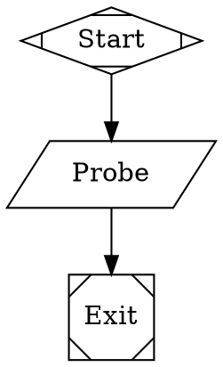

# Fabro-under-Docker-in-Docker (DinD) spike — `livespec-impl-beads-o2f`

Step 0 of the W7 orchestrator-convergence epic. De-risks containerizing the
Beads/Dolt + Fabro orchestrator with **Docker-in-Docker** (the orchestrator's
own container runs an *inner* dockerd; Fabro spawns its sandboxes on that inner
daemon, fully decoupled from the host daemon) **before** the production image is
built (a later step). Run on the host as `ubuntu` with Docker access.

## Goal

Prove, concretely, that:

1. A privileged glibc-based container can run a healthy *inner* Docker daemon on
   overlay2.
2. The `fabro` binary actually **runs** inside such a container (it does not on
   Alpine/musl) and, by construction, targets the inner daemon.
3. The nesting-safe storage-driver choice is recorded.
4. (stretch) A minimal Fabro script-node dispatch spawns a sandbox on the inner
   daemon.
5. (stretch) An ephemeral in-container Dolt sql-server validates the ledger
   substrate.

…so step 1 can build the production orchestrator image from a known-good recipe
instead of discovering these constraints during the build.

## Host facts (given / re-confirmed, not re-derived)

- Docker **28.2.2**, host storage driver **overlay2**, NOT rootless, kernel
  **6.17.0-22-generic**, `/dev/fuse` present, plain `docker run` works.
- Host glibc is **2.42** (Ubuntu).
- `fabro` binary: `~/.fabro/bin/fabro`, **v0.254.0**, `linux/x86_64`,
  glibc/x86-64 ELF (`interpreter /lib64/ld-linux-x86-64.so.2`, "for GNU/Linux").
  NOT on PATH. Subcommands include `run`, `server`, `install`, `doctor`,
  `preflight`, `validate`, `version`.
- `--privileged docker:28-dind` (Alpine) brings up a working inner daemon, but
  the fabro binary will NOT execute on it (musl, no glibc loader) — which is the
  whole reason this spike re-bases on a glibc image.

## What worked

| # | Goal | Result |
|---|------|--------|
| 1 | Privileged glibc container with inner dockerd on overlay2 | **PASS** — inner daemon up in 2s, overlay2 / backing FS extfs, nested `docker run --rm hello-world` exits 0 |
| 2 | `fabro` runs in-container + targets inner daemon | **PASS** — `fabro version` and `fabro doctor` execute on Ubuntu 24.04 (glibc 2.39); inner `/var/run/docker.sock` is the *only* socket present, so Fabro targets it by default |
| 3 | Nesting-safe storage-driver recommendation | **PASS** — overlay2 proven nested; vfs / fuse-overlayfs are documented fallbacks |
| 4 | Minimal script-node Fabro dispatch | **BLOCKED (documented)** — `fabro run` requires a configured server (`settings.toml`), which requires the install wizard (LLMs/certs/GitHub). Workflow *validates* (`fabro validate` OK); execution gated behind setup we deliberately did not do |
| 5 | Ephemeral in-container Dolt | **PASS** — dolt sql-server runs nested on inner daemon; trivial CREATE/INSERT/SELECT round-trips |

## The glibc base-image constraint (REFINED — a hard floor, not "Debian-or-Ubuntu")

The brief's "debian:12 or ubuntu:24.04" understates the constraint. **Debian 12
(bookworm) is too old** and was rejected outright:

```
$ fabro version   # on debian:12
fabro: /lib/x86_64-linux-gnu/libc.so.6: version `GLIBC_2.38' not found (required by fabro)
fabro: /lib/x86_64-linux-gnu/libc.so.6: version `GLIBC_2.39' not found (required by fabro)
```

`objdump -T` on the binary shows it links symbols up to **GLIBC_2.39**. Glibc
versions by base image:

| Base image | glibc | fabro runs? |
|---|---|---|
| `docker:28-dind` (Alpine/musl) | n/a (musl) | **NO** — missing glibc loader entirely |
| `debian:12` (bookworm) | 2.36 | **NO** — GLIBC_2.38 / 2.39 not found |
| `ubuntu:24.04` (noble) | **2.39** | **YES** — exactly the minimum |
| host | 2.42 | yes |

**Hard rule for the step-1 image: base on `ubuntu:24.04` (or any base providing
glibc ≥ 2.39).** `debian:12` will silently pass the dockerd checks and then fail
only when fabro is invoked. (A `debian:13`/trixie base ships glibc 2.41 and would
also satisfy the floor, but `ubuntu:24.04` is the proven choice here.) Pin the
fabro binary and this glibc floor together; a future fabro that bumps its glibc
requirement would break an older base the same way.

## Storage-driver choice (nesting-safe)

**Use overlay2 (the default on a modern dockerd) — but `/var/lib/docker` MUST sit
on a non-overlay filesystem.**

The non-obvious failure: a fresh privileged container's rootfs is itself an
**overlay** mount (it is the host's overlay2 graph driver). If the inner dockerd's
`/var/lib/docker` lives on that overlay rootfs, the inner overlay2 mount fails:

```
level=error msg="failed to mount overlay: invalid argument" storage-driver=overlay2
...
graphdriver(s)=vfs    # silent fallback to vfs (slow, no hardlinks)
```

The fix is exactly what the official `docker:dind` image does via its
`VOLUME /var/lib/docker`: back `/var/lib/docker` with a **volume / bind mount on
ext4** (not the overlay rootfs). With that, the inner daemon reports:

```
Storage Driver: overlay2 | [Backing Filesystem extfs] [Supports d_type true] [Native Overlay Diff true]
```

…matching the orchestrator's earlier `docker:dind` result. This is why
`docker:dind` "just worked" and a naive `apt-get install docker.io` did not: the
volume, not the package, is load-bearing.

On Ubuntu 24.04 the `docker.io` package is **Docker 29.1.3**, whose default image
store is the **containerd snapshotter**; it reports the driver as `overlayfs`
(`io.containerd.snapshotter.v1`) — the modern overlay-based equivalent, also
nesting cleanly with no mount errors. Either is fine; both are overlay-on-ext4.

**Fallbacks (only if a *different* host kernel ever rejects nested overlay2):**
`vfs` (correct everywhere, no kernel deps, but slow and space-hungry — acceptable
for short-lived sandboxes) or `fuse-overlayfs` (needs `/dev/fuse` + the
`fuse-overlayfs` binary on PATH; the inner daemon already probes for it). On
**this** kernel (6.17) neither is needed — overlay2/overlayfs on an ext4-backed
`/var/lib/docker` is sufficient.

## Fabro-targets-inner-daemon evidence (the primary proof; NO secrets)

`fabro version` on the Ubuntu 24.04 container — the client section is fully
populated, proving the binary executes (the Alpine failure is gone):

```
Client:
 Version:      0.254.0
 Git SHA:      497aaba
 OS/Arch:      linux/x86_64
Server: /root/.fabro/fabro.sock
 Error:        Failed to start fabro server ...   # expected: no server configured yet
```

`fabro doctor`:

```
Fabro Doctor
  Local
  [!] Configuration (no settings config file found)
  Server
  [✗] Fabro server (unreachable)
Found issues in 2 categories.
```

Doctor runs (binary executes — the glibc proof). Its Docker/integration checks
sit *behind* a configured+running fabro server, so they are not surfaced in this
unconfigured state; we did not stand the server up (see the Goal-4 blocker).

**The decoupling proof is architectural and conclusive:** inside the container
`DOCKER_HOST` is **unset**, so Fabro (and every `docker` client) defaults to
`unix:///var/run/docker.sock`. The only socket present at that path is the
**inner** dockerd's (`srw-rw---- root docker /var/run/docker.sock`) — the daemon
this spike started. **No host socket is mounted** (the deliberate DinD vs DooD
distinction). Therefore any sandbox Fabro spawns lands on the inner daemon by
construction. Confirmed end-to-end by Goal 5: a container started via the inner
client (`docker run …`) is visible only in the inner `docker ps -a`, never on the
host.

## Minimal-dispatch result (Goal 4) — documented blocker

A single **script node** (no agent, no LLM) workflow was authored as Graphviz DOT
(Fabro's workflow format) and **validates cleanly**:


```
$ fabro validate /root/spike.fabro
Workflow: Spike (3 nodes, 2 edges)
Validation: OK
```

**Exact blocker on `fabro run`:**

```
× Failed to start fabro server for /root/.fabro/storage
╰─▶ Cannot reach Fabro server: no settings.toml configured.
    Run one of:
      fabro server start    # browser-based wizard
      fabro install         # terminal wizard
```

`fabro run` will not execute *any* workflow — even a pure script node — without a
configured fabro server (`~/.fabro/settings.toml`). Configuration comes only via
`fabro server start` (a **browser-based** install wizard: it prints a
`http://127.0.0.1:32276/install?token=…` URL and cannot open a browser headlessly)
or `fabro install` (a terminal wizard whose job is "Set up the **LLMs, certs,
GitHub**"). There is a `fabro install --non-interactive` mode, but it still
requires the scripted LLM-provider / GitHub inputs — i.e. the very model-key/auth
setup the spike was scoped to avoid, and which belongs to a later wired-up step,
not to a 20-minute de-risking spike.

This is a **Fabro setup-flow constraint, not a DinD constraint** — nothing about
the inner daemon, glibc base, or storage driver is implicated. The architectural
proof (binary runs + inner socket is the only target) plus `fabro validate` is
sufficient spike evidence per scope. Goal-4 full execution is correctly the
business of step 1 (build the image with `settings.toml` injected) / a later wired
run, where the injectable externals below are provided.

## Ephemeral-Dolt result (Goal 5) — PASS

```
# on the INNER daemon, inside the privileged container:
$ docker run -d --name o2f-dolt -p 3308:3306 dolthub/dolt-sql-server:latest
$ docker exec o2f-dolt dolt sql -q \
    "CREATE DATABASE spikedb; USE spikedb;
     CREATE TABLE t(id INT PRIMARY KEY, v VARCHAR(16));
     INSERT INTO t VALUES (1, 'hello-dind'); SELECT id, v FROM t;"
+----+------------+
| id | v          |
+----+------------+
| 1  | hello-dind |
+----+------------+
```

dolt **2.1.7**, container visible only in inner `docker ps -a`. This validates an
**in-container ledger substrate**: the orchestrator can run a throwaway/ephemeral
Dolt for sandbox-local state. NOTE — this is the *ephemeral / scratch* pattern.
The production beads-on-Dolt **family tenant** ledger is an **external** Dolt
`sql-server` (TCP `127.0.0.1:3307`, per-tenant password) and should be injected as
an endpoint (below), not run inside the orchestrator container.

## Recommendation for the step-1 production orchestrator image

**Base image.** `ubuntu:24.04` (glibc 2.39 — the hard floor fabro v0.254.0
requires). Do NOT use `debian:12` (glibc 2.36, fabro won't run) or the Alpine
`docker:dind` (musl, fabro won't run).

**Inner Docker daemon.** `apt-get install -y docker.io` (yields Docker 29.x with
the containerd image store on noble — fine), then start `dockerd` in the
background at container entry and block until `/var/run/docker.sock` exists and
`docker info` succeeds. Keep the entrypoint a tiny supervisor: start dockerd →
wait for socket → start the orchestrator/dispatcher. (Optionally pin docker via
the official `download.docker.com` apt repo if a specific engine version is
wanted; the distro `docker.io` was sufficient for the spike.)

**Storage driver.** overlay2 / containerd-overlayfs — but **declare
`VOLUME /var/lib/docker`** (or mount a tmpfs/volume there at run time) so the
inner graph store is on ext4, not the overlay rootfs. Without this the inner
daemon silently degrades to vfs. No exotic driver needed on the 6.17 host;
fuse-overlayfs / vfs are documented fallbacks only.

**Fabro install.** `COPY` (or `docker cp`) the pinned glibc fabro binary to
`/usr/local/bin/fabro` (`chmod +x`). Pin the binary version and the glibc floor
together. The fabro **server config** (`~/.fabro/settings.toml`) and any
provider/cert/GitHub setup must be **provisioned by the image build / injected at
run** — not by an interactive wizard. That is the Goal-4 gap and is squarely
step-1's job.

**Privileged.** **Required.** The inner dockerd needs `--privileged` (cgroup,
device, and mount capabilities) to run nested. There is no unprivileged-DinD path
in scope here. Run the orchestrator container with `--privileged`.

**Injectable externals (env / mounts / secrets — never baked into the image):**

- **Ledger endpoint** — the external beads/Dolt family tenant: `dolt.host` /
  `dolt.port` (`127.0.0.1:3307`, reachable from the container — likely
  `--network host` or an explicit route), the tenant DB name (== repo name), and
  the per-tenant password `BEADS_DOLT_PASSWORD_<tenant>` injected at run via the
  1Password env wrapper. The committed `.beads/config.yaml` (server keys, no
  `socket`) is mounted/checked-out, `metadata.json` is regenerable. (The
  *ephemeral* in-container Dolt from Goal 5 is a separate, optional scratch
  pattern — not the family ledger.)
- **Model / LLM key** — provider API key(s) for fabro's agent nodes, injected as
  env / via `fabro secret`. Required to populate `settings.toml` and run anything
  beyond a pure script node.
- **Git credentials** — the GitHub token / App config (`fabro install github`)
  for clone/push/PR. Inject via env / `fabro secret` (Fabro embeds the token in
  sandbox clone remote URLs — never print `git remote -v` / env / URLs from
  nodes).
- **Honeycomb key** — the orchestrator's OTel/Honeycomb API key for telemetry,
  injected as env (e.g. `HONEYCOMB_API_KEY`).

All four are runtime-injected (env vars, mounted config, or `fabro secret`),
keeping the image itself secret-free and the same image usable across tenants.

A reference **PROTOTYPE Dockerfile** capturing this recipe is at
`dind-spike/Dockerfile` in this directory. It is spike evidence / a starting
point — **NOT the production image** (that is step 1, which must add the
`settings.toml` provisioning, the entrypoint supervisor, and the externals
above).

## Cleanup

All spike artifacts on the host were removed after capture: the `o2f-dind-spike`
privileged container, the `o2f-dind-varlib` volume, and the `debian:12` /
`ubuntu:24.04` images pulled only for the spike. The nested `o2f-dolt` /
`hello-world` / `alpine` images lived on the *inner* daemon and were destroyed
with the container. Pre-existing host images (the heavy
`livespec-fabro-sandbox:*`) and the host fabro daemon/state were left untouched.
